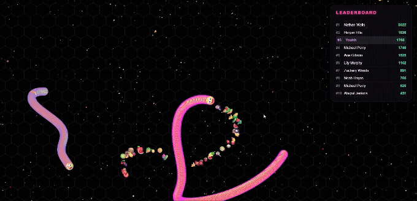

# Snake Zone

<p align="center">  </p>

**Snake Zone** is a fun, fast-paced, browser-based snake game inspired by popular titles like Slither.io. Players control a snake, consume food to grow larger, and compete against computer-controlled snakes to climb the leaderboard!

## 🌟 Features

- **Smooth Gameplay:** Built entirely with HTML5 Canvas and Vanilla JavaScript for optimal performance.
- **Dynamic Leaderboard:** Real-time ranking system to track your progress against opponents.
- **Cross-Platform Controls:** Supports both mouse/keyboard for desktop and touch controls for mobile devices.
- **Speed Boost:** Accelerate your snake to outmaneuver opponents, but be careful—it costs points!
- **Emoji Food:** A colorful variety of emoji-based food items to consume.

## 🎮 How to Play

### Goal
Eat as much food as possible to grow your snake and increase your score. Avoid running your head into the bodies of other snakes, or you will die!

### Controls
- **Desktop (Mouse):**
  - **Move:** Move your mouse cursor; the snake will follow it.
  - **Speed Boost:** Click and hold the Left Mouse Button to accelerate.
- **Mobile (Touch):**
  - **Move:** Swipe or drag your finger across the screen.
  - **Speed Boost:** Tap and hold your finger on the screen.

*Note: Using the speed boost will slowly drain your score/mass!*

## 🛠️ Tech Stack

- **HTML5:** Structure of the web page.
- **CSS3:** Styling, UI overlays, and animations.
- **JavaScript (Vanilla):** Game logic, canvas rendering, collision detection, and opponent behavior.

## 🚀 Installation & Setup

1. **Clone the repository:**
   ```bash
   git clone https://github.com/ayush-097/snakezone.git
   ```
2. **Navigate to the directory:**
   ```bash
   cd snakezone
   ```
3. **Run the game:**
   Simply open the `index.html` file in your favorite modern web browser. No server setup or build process is required!

## 👨‍💻 Author

- [Ayush Dobariya](https://github.com/ayush-097)

---
**Version v1.0.0**
